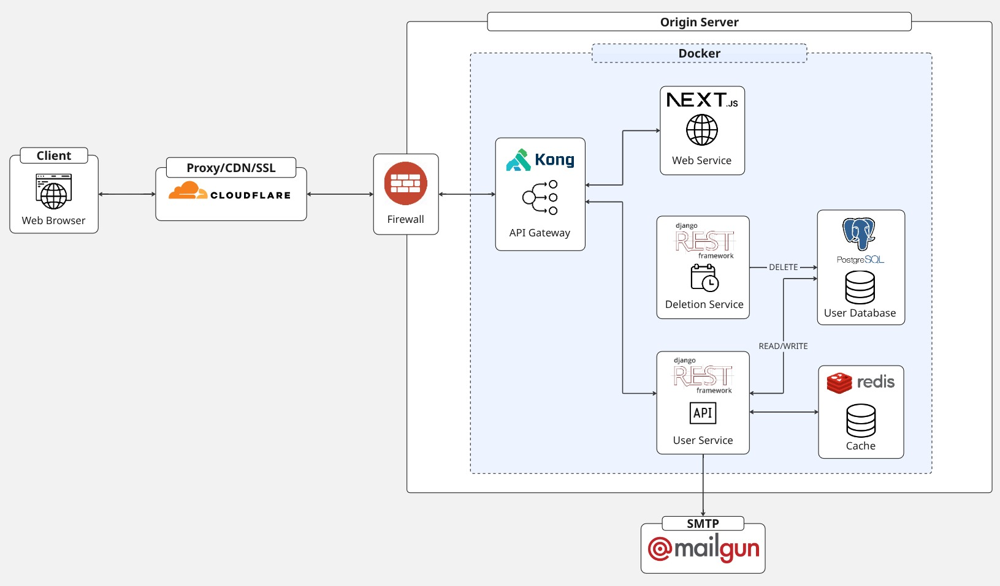

## About the Project

This project is a production-ready full stack web application built to explore modern development practices and tools.

The live application is available at [https://dvi-app.xyz](https://dvi-app.xyz).

## Architecture Overview

- **Frontend**: Next.js + TypeScript serving a responsive user interface.
- **Backend**: Django REST Framework powering a user microservice (handles authentication, user management, email sending) and a separate scheduled deletion microservice for regularly cleaning up users that requested account deletion.
- **API Gateway**: Kong Gateway sits in front of both services, handling routing, rate limiting, CORS, and acting as a unified entry point.
- **Data Layer**: PostgreSQL as the primary database and Redis for caching.
- **Infrastructure**:
  - Containerized with Docker Compose and deployed on a Hetzner VPS.
  - Protected by a provider-level firewall that only allows traffic from Cloudflare and trusted IPs.
  - Cloudflare handles DNS, CDN, SSL termination, caching, WAF, and DDoS protection.
  - Email delivery via Mailgun SMTP.
  - Daily encrypted database backups stored on the server.

The architecture tries to emphasize security, scalability, and separation of concerns.

